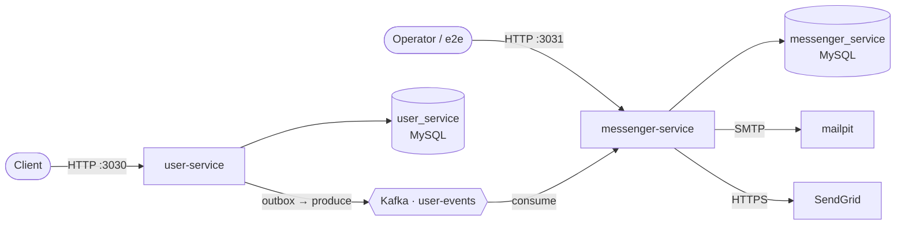

# Pattern Shop

Two Rust services, each with its own MySQL database, connected by Kafka.



- **user-service** (`:3030`) — accounts, sessions, password reset. Writes each event to an
  outbox in the same transaction; a poller publishes it.
- **messenger-service** (`:3031`) — consumes events, picks a provider, renders and sends
  (SendGrid or SMTP), records the result. Idempotent per `event_id`.

## Docs

- [`docs/setup.md`](docs/setup.md) — one-time setup (prerequisites, credentials, hook)
- [`docs/running.md`](docs/running.md) — run, debug, smoke-test, all test commands
- [`docs/architecture.md`](docs/architecture.md) — how it fits together
- [`docs/user-service.md`](docs/user-service.md) / [`docs/messenger-service.md`](docs/messenger-service.md) — API, flows, data model
- [`AGENTS.md`](AGENTS.md) — conventions for agents

## Layout

```
crates/db-core/               # shared DB plumbing (pool, migrations, safe SELECT builder)
crates/events/                # Kafka event contract
services/user-service/        # :3030 — src/db/ + migrations/
services/messenger-service/   # :3031 — src/db/ + migrations/
e2e/                          # cross-service tests
docker-compose.yml            # mysql, kafka, mailpit, both services
docs/                         # documentation
```

## Quick start (local dev: infra in Docker, services with cargo)

```sh
make env         # 1. write .env with random DB credentials (git-ignored)
make hooks       # 2. optional: install the pre-commit hook
make infra-up    # 3. start mysql + kafka + mailpit
make dev         # 4. run both services; Ctrl-C stops both
```

## Full stack in Docker (no cargo needed)

```sh
make up          # build + start everything detached
make down        # stop and delete the databases
```

| Service | URL |
|---|---|
| user-service | http://localhost:3030 |
| messenger-service | http://localhost:3031 |
| mailpit UI (emails) | http://localhost:8025 |
| kafka-ui (optional) | http://localhost:8080 (`--profile debug`) |

## Testing

```sh
make test-unit          # pure logic
make test-integration   # service tests against MySQL
make test-e2e           # full stack + cross-service tests
make test               # all three
make check              # fmt + clippy + no-unwrap gates
```
