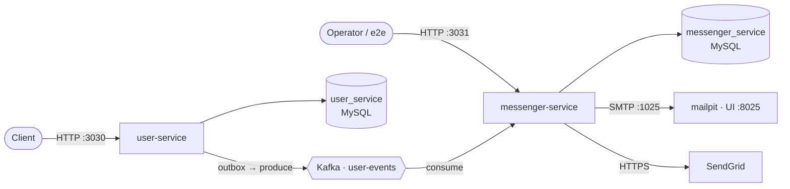

# Architecture

Two Rust services, each with its own MySQL database, talking over Kafka.



## How it fits together

- **user-service** owns accounts: register, login (one session per user, sessions expire),
  user data, password reset. Each state change writes its Kafka event in the same database
  transaction (an outbox); a poller publishes it.
- **messenger-service** owns delivery: consumes `user-events`, picks the provider for the
  event type, renders a template, sends (SendGrid or SMTP), records the result. Delivery is
  idempotent per `event_id`.
- **crates/events** defines the event contract (schema-versioned).
- **crates/db-core** holds schema-agnostic DB plumbing (pool, migration runner, safe
  `SELECT` builder), unit-tested against SQLite.

## Layout

```
crates/db-core/               # shared DB plumbing
crates/events/                # Kafka event contract
services/user-service/        # warp :3030 + src/db/ + migrations/
services/messenger-service/   # warp :3031 + src/db/ + migrations/
e2e/                          # cross-service tests (compose stack)
docs/                         # this + per-service + setup docs
```

## More docs

- [`setup.md`](setup.md) — prerequisites, run, test, Docker
- [`user-service.md`](user-service.md) — API, flows, data model
- [`messenger-service.md`](messenger-service.md) — API, delivery, data model
- [`../AGENTS.md`](../AGENTS.md) — conventions for agents
