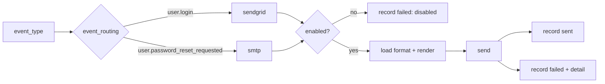
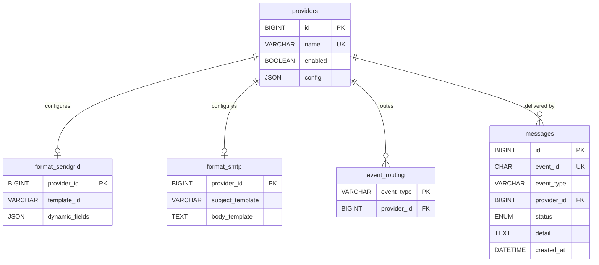

# messenger-service

Provider-based email delivery. `warp` on **:3031**, database **messenger_service**.
Code: `services/messenger-service` (SQL in `src/db/repo.rs`, migrations in `migrations/`).

It consumes the `user-events` topic (group `messenger-service`) and also exposes
`POST /send` for direct/testing use. Both paths share the same
route → render → send → record logic.

## API

| Method | Path | Body | Notes |
|---|---|---|---|
| GET | `/health` | — | 200 when healthy |
| POST | `/send` | `{event_type, to, variables, event_id?}` | routes, renders, sends, records. `event_id` is the idempotency key |

`POST /send` returns `200` with `{event_id, status, provider?, detail?}` where `status`
is `sent`, `failed` or `duplicate`; unknown event types return `400`.

## Delivery flow



The consumer validates the event schema version and skips newer/malformed events.
Duplicate `event_id`s are ignored (idempotency comes from the unique `messages.event_id`).

## Data model



## Providers

- **sendgrid** — HTTP v3 `/mail/send`; `template_id` + `dynamic_fields` placeholder mapping.
  `config` holds `api_key` (tests) or `api_key_env` (production, names an env var).
- **smtp** — lettre; `format_smtp` holds `subject_template`/`body_template` with
  `{{username}}`, `{{otp}}`. Plaintext, so it works with mailpit.

## Config

| Variable | Default | Purpose |
|---|---|---|
| `MESSENGER_DATABASE_URL` | — | MySQL connection (required) |
| `MESSENGER_PORT` | `3031` | HTTP port |
| `KAFKA_BROKERS` | `kafka:9092` | Kafka bootstrap |
| `SENDGRID_API_KEY` / `SENDGRID_BASE_URL` | empty / `https://api.sendgrid.com` | SendGrid provider |
| `SMTP_HOST` / `SMTP_PORT` / `SMTP_FROM` | `localhost` / `1025` / … | SMTP host override (containers use the DB config `mailpit:1025`) |
| `RUST_LOG` | `info` | log filter |

## Run & debug this service

```sh
make infra-up         # once
make dev-messenger    # cargo run -p messenger-service -> :3031
```

Breakpoints on `process_message` (`service.rs`) and `handle_event`
(`consumer.rs`); full walkthrough in [`running.md`](running.md).
