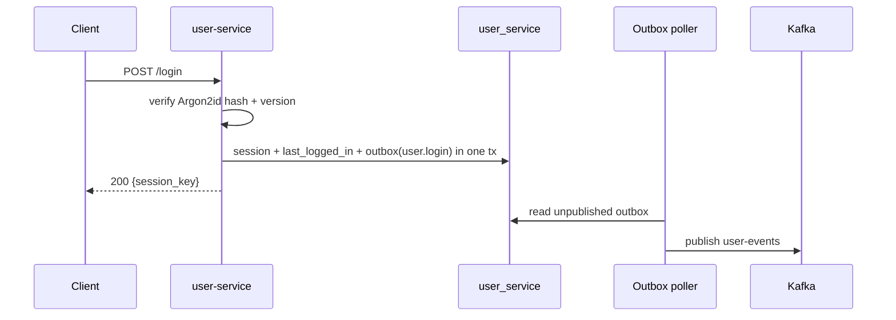
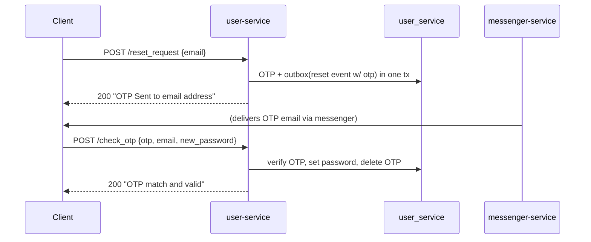
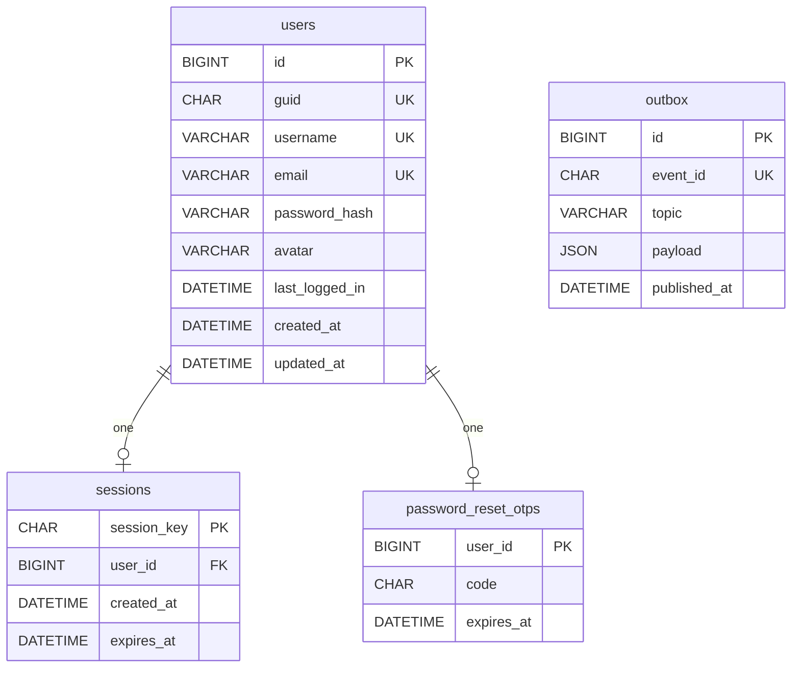

# user-service

Accounts, sessions and password reset. `warp` on **:3030**, database **user_service**.
Code: `services/user-service` (SQL in `src/db/repo.rs`, migrations in `migrations/`).

## API

| Method | Path | Body | Notes |
|---|---|---|---|
| GET | `/health` | — | 200 when healthy |
| POST | `/register` | `{username, email, password}` | usernames/emails stored lowercase; returns empty `session_key` |
| POST | `/login` | `{username, password, version}` | `version >= 0.1`; returns `{session_key, username}`; replaces the user's session |
| POST | `/user_data` | `{username, session_key}` | returns `{username, email, avatar}` |
| POST | `/update_user_data` | `{username, new_username?, email?, avatar?, session_key}` | persists the change |
| POST | `/reset_request` | `{email}` | creates a 4-digit OTP and publishes a reset event |
| POST | `/check_otp` | `{otp, email, password}` | sets the new password and deletes the OTP |

Errors return `400` with a plain-text reason (the legacy `CustomRejection` style).

## Login flow



## Password reset flow



## Data model



## Config

| Variable | Default | Purpose |
|---|---|---|
| `DATABASE_URL` | — | MySQL connection (required) |
| `SERVICE_PORT` | `3030` | HTTP port |
| `OTP_TTL_MINUTES` | `120` | OTP validity |
| `SESSION_TTL_MINUTES` | `10080` | session lifetime |
| `SESSION_CLEANUP_INTERVAL_SECONDS` | `3600` | expired-session sweep |
| `OUTBOX_POLL_MS` | `1000` | outbox publish interval |
| `KAFKA_BROKERS` | `kafka:9092` | Kafka bootstrap |
| `RUST_LOG` | `info` | log filter |

## Behaviour notes

- **Argon2id** password hashing (`password.rs`).
- **One session per user** (upsert); expired sessions rejected and swept by a worker.
- OTPs are **single-use**.
- Login/reset never fail because Kafka is down — the event waits in the outbox.

## Run & debug this service

```sh
make infra-up      # once
make dev-user      # cargo run -p user-service -> :3030
```

Breakpoints on `handle_register` / `handle_login` / `request_password_reset`
(`routes.rs`); full walkthrough in [`running.md`](running.md).
